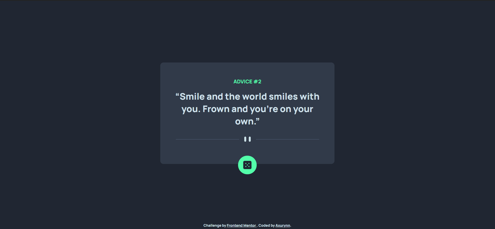
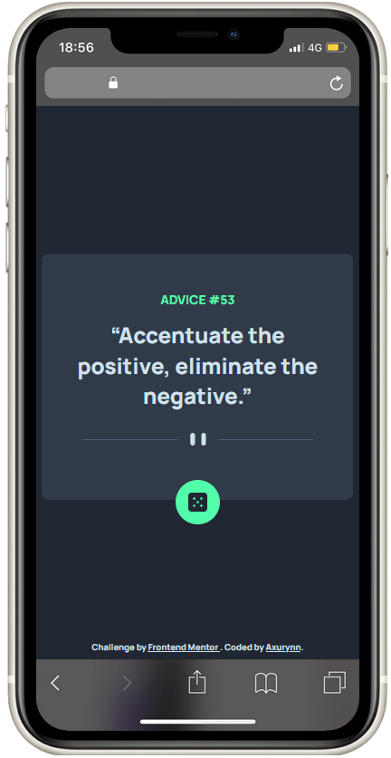

# Frontend Mentor - Advice generator app solution

This is a solution to the [Advice generator app challenge on Frontend Mentor](https://www.frontendmentor.io/challenges/advice-generator-app-QdUG-13db). Frontend Mentor challenges help you improve your coding skills by building realistic projects.

## Table of contents

- [Frontend Mentor - Advice generator app solution](#frontend-mentor---advice-generator-app-solution)
  - [Table of contents](#table-of-contents)
  - [Overview](#overview)
    - [The challenge](#the-challenge)
    - [Screenshots](#screenshots)
    - [Links](#links)
  - [My process](#my-process)
    - [Built with](#built-with)
    - [What I learned](#what-i-learned)
    - [Useful resources](#useful-resources)
  - [Author](#author)
  - [Acknowledgments](#acknowledgments)

## Overview

### The challenge

Users should be able to:

- Reload a new advice at every click on the green dice.

### Screenshots

Desktop screenshot



Mobile screenshot



### Links

- Solution URL: [advice-generator-app](https://github.com/Axurynn/advice-generator-app)
- Live solution: [advice-generator-app_live](https://axurynn.github.io/advice-generator-app/)

## My process

### Built with

- Semantic HTML5 markup
- CSS custom properties
- Flexbox
- Mobile-first workflow
- JavaScript vanilla

### What I learned

I learned about the click event with fetch action. When you want to fetch data on click, you need to reload the page.

```js
document.querySelector('.dice').addEventListener("click", () => window.location.reload())
```

### Useful resources

- [Click event](https://developer.mozilla.org/fr/docs/Web/API/EventTarget/addEventListener) - This helped me for the click event syntax.
- [How to fetch data on click event](https://forum.djangoproject.com/t/updating-model-after-click-event-with-javascript/6795) - This is an amazing article which helped me finally understand how to fetch data on click event.

## Author

- Website - [Axurynn](https://axurynn.fr)
- Frontend Mentor - [@axurynn](https://www.frontendmentor.io/profile/axurynn)
- Twitter - [@Drc_Axu](https://www.twitter.com/Drc_Axu)

## Acknowledgments

Special thanks to [Baptjack](https://baptjack.fr) who help me completed this challenge.
